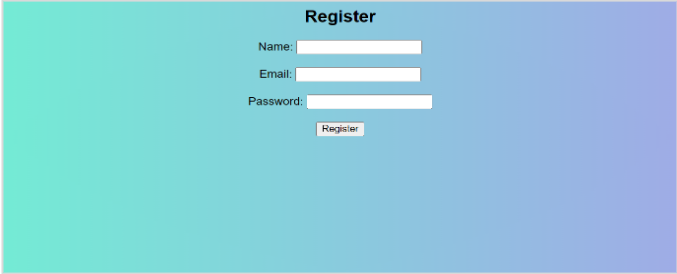
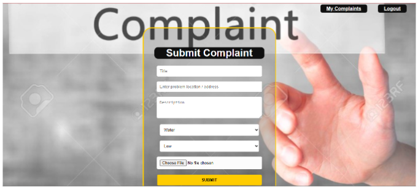
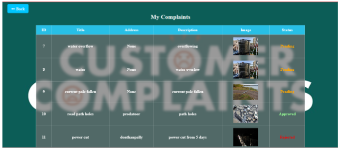
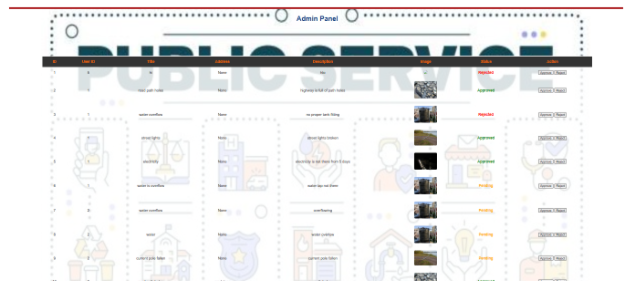

# Smart-Complaint-Form
A web based complaint management platform developed using flask and SQLite that allows users to register complaints upload image proof and track complaint status in real time. The system includes separate user and admin roles where administrators can view complaints update status and mark issues as resolved. It is a user friendly interface

## Features

- User Registration & Login
- Submit Complaints
- Upload Image Proof
- Track Complaint Status
- Admin Dashboard
- Update Complaint Status
- Resolve Complaints

  ## Tech Stack

- Frontend: HTML, CSS
- Backend: Flask
- Database: SQLite
- Programming Language: Python
- Template Engine: Jinja2

## Project Structure

smart-complaint-form/

│── app.py

│── admin.html

│── admin_dashboard.html

│── admin_login.html

│── dashboard.html

│── login.html

│── my_complaints.html

│── register.html  

## Database Tables

### Users Table

- id
- username
- password
- role

### Complaints Table

- id
- name
- complaint
- status
- admin

## Installation

1. Start XAMPP
2. Open project folder
3. Run the following command:

```bash
python app.py
```

## Screenshots

### Login 


### Register


### User


### Complaints


### Admin



